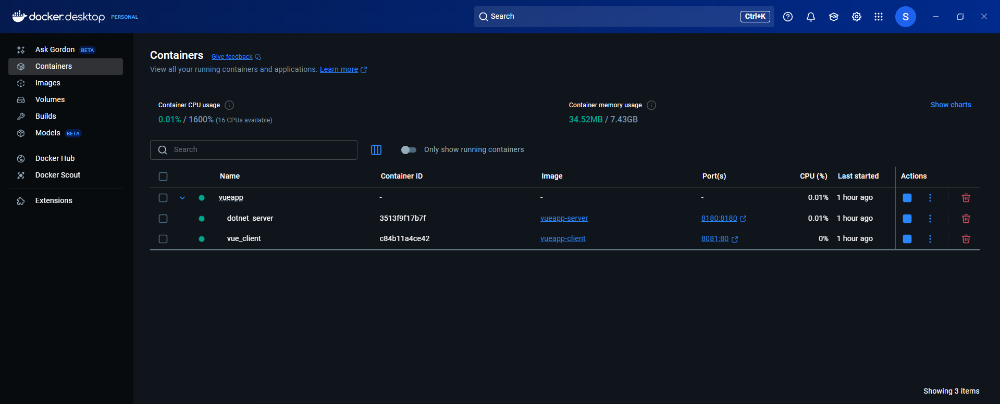

# vue-with-dotnet-docker
Containerizing a Vue.js (3.5.13) frontend with a .NET Core 8 backend using Docker involves creating separate Docker images for each component and potentially orchestrating them with Docker Compose.



##   1. Dockerizing the .NET Core 8 Backend:
- Dockerfile: Create a Dockerfile in .NET Core project's root directory. A multi-stage build is recommended to reduce the final image size.
- VueApp.Server / Dockerfile :

```dockerfile 
# Stage 1: Build the .NET application
FROM mcr.microsoft.com/dotnet/sdk:8.0 AS build
WORKDIR /src

# Copy the server project file and restore dependencies
COPY VueApp.Server.csproj ./
RUN dotnet restore VueApp.Server.csproj

# Copy the entire solution and build
COPY . .
WORKDIR /src
RUN dotnet build "VueApp.Server.csproj" -c Release -o /app/build

# Stage 2: Publish the .NET application
FROM build AS publish
WORKDIR /src
RUN dotnet publish "VueApp.Server.csproj" -c Release -o /app/publish

# Stage 3: Create the final runtime image
FROM mcr.microsoft.com/dotnet/aspnet:8.0 AS final
WORKDIR /app
EXPOSE 8180 
COPY --from=publish /app/publish .
ENTRYPOINT ["dotnet", "VueApp.Server.dll"]
``` 

- Build Image: Cd to your .NET project directory in the terminal and build the Docker image.
```dockerfile
 docker build -t vue-app-server .
```

## 2. Dockerizing the Vue.js Frontend:
- Dockerfile: Create a Dockerfile in Vue.js project's root directory. Use a multi-stage build to first build the Vue application and then serve the static files with a lightweight web server like Nginx.
- vueApp.client / Dockerfile : 

```dockerfile
# Build stage
FROM node:lts-alpine AS build
WORKDIR /app
COPY package.json .
RUN npm install
COPY . .
#RUN npm run build
RUN DOCKER=true npm run build


# Serve stage
FROM nginx:stable-alpine
COPY --from=build /app/dist /usr/share/nginx/html
#Running Port Api
EXPOSE 8180 
CMD ["nginx", "-g", "daemon off;"]
```

-   Build Image: Cdd to Vue project directory in the terminal and build the Docker image.

```dockerfile
 docker build -t vue-app-client .
```

##  3. Orchestrating with Docker Compose (Optional but Recommended):
-   docker-compose.yml: Create a docker-compose.yml file in a parent directory that contains both your .NET and Vue projects.

```dockerfile
#version: '3.8'

services:
  client:
    build:
      context: ./vueapp.client
      dockerfile: Dockerfile
    container_name: vue_client            
    ports:
      # Host port 8081 → Vue container's port 80
      - "8081:80" 
    networks:
      - app_network
    depends_on:
      - server

  server:
    build:
      context: ./VueApp.Server
      dockerfile: Dockerfile
    container_name: dotnet_server
    ports:
      # Host port 8180 → .NET app port 8180
      - "8180:8180" 
    networks:
      - app_network
    environment:
      - ASPNETCORE_URLS=http://+:8180
      - ASPNETCORE_ENVIRONMENT=Production

networks:
  app_network:
    driver: bridge

```

- Run with Docker Compose: Cd to the directory containing docker-compose.yml and run:

```dockerfile
docker compose up --build -d 
```
 
This setup allows you to run your Vue.js frontend and .NET Core 8 backend in separate, isolated Docker containers, facilitating development and deployment. Remember to adjust port mappings and project directories as needed for your specific setup.